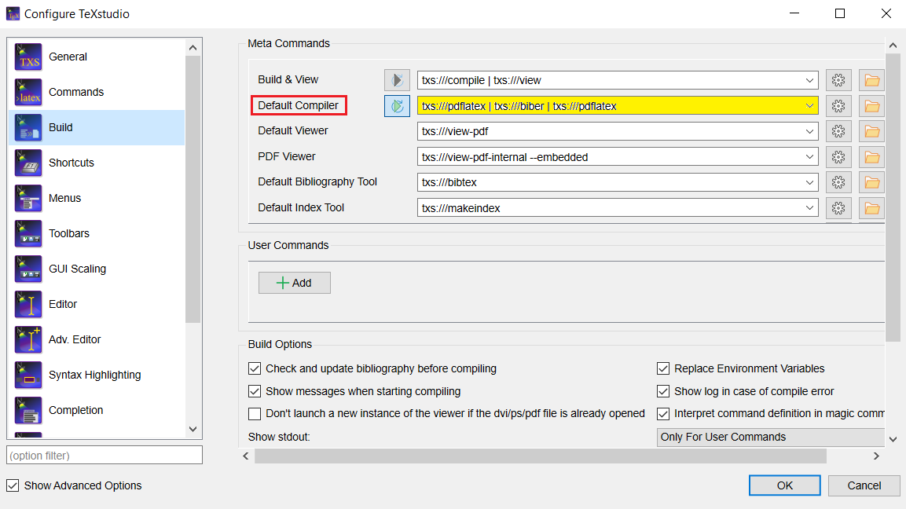

# Gaussian Processes

This is an introduction to the basics of Gaussian Processes (GP). Particulary, we are interested in their applications for regression and machine learning. The tutorial is mainly divided in two parts. In the first part, we present a step-by-step explanation of the necessary mathematics to understand GPs. For this purpose, we assume that the reader is familiar with linear algebra, probability, and multivariable calculus. In this part, we touch upon the Cholesky decomposition, the matrix inversion lemma for partitioned matrices, MultiVariate Normal (MVN) Probability Density Functions (PDF) for continuous random vectors, and three main operations assosiated with MVNs, namely sampling, conditioning, and marginalization. In the second part, we define what a GP is and learn how to do regression with GPs in the cases of noise-free and noisy data observations. Afterwards, we present a simple algorithm to do regression with GPs, investigate its time complexity and implementation. Then, we study the effect of hyperparameters of a special kernel function, well known as the Radial Basis Function (RBF), on the predictive distribution. This sets the motivation for optimizing the hyperparameters, which we shall address briefly via introducing Cross Validation (CV) and Marginal Likelihood (ML). We also talk about the methods of combining available kernels to construct new ones. Afterwards, we address a real world application of GPs for designing interactive interfaces. The paper concludes with some remarks about the connection of GPs with other models and their capability for scaling. 

# Requirements for Compiling TeX Files
- `TeXLive 2022` and above.
- Make sure the complier setting in your TeX editor uses `pdfLaTeX` and `biber`. For example, the setting for `TeXstudio` is shown in the following figure. However, the `.pdf` file of the last edition is also available in the `docs` folder.

